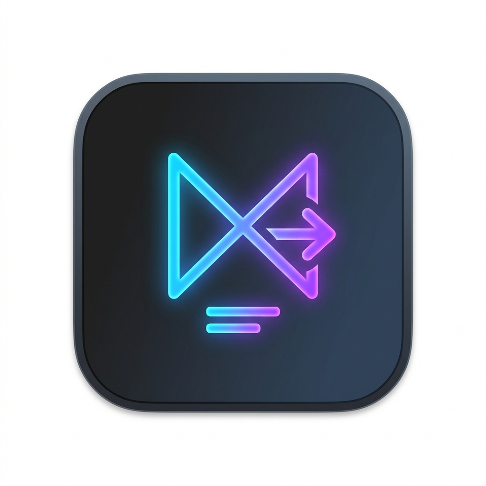

<p align="center">
  
</p>

<h1 align="center">MdView</h1>

<p align="center">
  A native macOS Markdown viewer & editor with QuickLook support, live preview, math equations, syntax highlighting, and PDF export.
</p>

<p align="center">
  
  
  
  
</p>

---

## ✨ Features

| Feature | Description |
|---|---|
| 📝 **Live Markdown Editor** | Split-pane editor with a monospaced code font on the left, live rendered preview on the right |
| 🔢 **LaTeX Math Equations** | Full support for inline `$...$` and block `$$...$$` equations powered by **KaTeX** |
| 🎨 **Syntax Highlighting** | Code blocks with automatic language detection via **highlight.js** (GitHub theme, dark mode aware) |
| 📊 **Tables, Blockquotes, Task Lists** | Full GFM (GitHub Flavored Markdown) support |
| 🔍 **QuickLook Integration** | Press `Space` on any `.md` file in the Finder for an instant rich preview |
| 📄 **PDF Export** | Export your document as a single continuous-page PDF |
| 📂 **Native File Management** | `Cmd+O` to open, `Cmd+S` to save, `Cmd+N` for new documents — using Apple's DocumentGroup API |
| 🌙 **Dark Mode** | Full automatic light/dark mode for both the editor and QuickLook previews |
| 🔗 **Default App Registration** | Automatically prompts to become the default viewer for `.md` files on first launch |

---

## 📷 Screenshot

> *Open a `.md` file or press `Cmd+N` to get started.*

---

## 🚀 Installation

### Option 1 — Download the DMG (recommended)

1. Download `MdView.dmg` from the [**Releases**](../../releases/latest) page
2. Open the DMG and drag **MdView.app** to your `/Applications` folder
3. Launch MdView — it will auto-register the QuickLook extension on first start

> **Note:** The app is signed locally (*Sign to Run Locally*). On first launch, right-click the app and choose **Open** to bypass macOS Gatekeeper if needed.

### Option 2 — Build from source

**Requirements:** Xcode 16+, Homebrew

```bash
# Install xcodegen
brew install xcodegen

# Clone and build
git clone https://github.com/lysandrelaborde/MdView.git
cd MdView
./build.sh
```

The script will automatically:
- Generate the Xcode project via `xcodegen`
- Compile in Release mode (Universal Binary: Intel + Apple Silicon)
- Sign locally and create `MdView.dmg`

---

## 📦 What's inside the DMG?

The `.app` bundle is fully **self-contained** — no internet connection required at runtime:

| Asset | Purpose |
|---|---|
| `marked.min.js` | Markdown parser |
| `katex.min.js` + fonts | LaTeX math rendering |
| `highlight.min.js` + CSS | Code syntax highlighting |
| `MdViewQuickLook.appex` | QuickLook Finder extension |
| `AppIcon.icns` | Application icon |

---

## 🛠 Tech Stack & Tools

| Tool | Role |
|---|---|
| **Swift 5.9 / SwiftUI** | Main application UI and logic |
| **WKWebView** | Markdown rendering engine |
| **marked.js** | Markdown → HTML parser |
| **KaTeX** | LaTeX math equation rendering |
| **highlight.js** | Code syntax highlighting |
| **xcodegen** | Project file generation from `project.yml` |
| **Google Gemini 1.5 Pro & Claude 3.5 Sonnet** (via Antigravity) | AI pair-programming assistant — architecture design, bug fixes, and code generation throughout the project |

---

## 📁 Project Structure

```
MdViewer/
├── MdView/
│   └── Sources/
│       ├── MdViewApp.swift          # App entry point, default app registration
│       ├── ContentView.swift        # Split-pane editor UI
│       ├── MarkdownWebView.swift    # WKWebView renderer + PDF export
│       ├── MarkdownDocument.swift   # FileDocument for native file management
│       ├── marked.min.js            # Bundled Markdown parser
│       ├── katex.min.js / .css      # Bundled KaTeX
│       ├── highlight.min.js / .css  # Bundled highlight.js
│       └── katex-fonts/             # Bundled KaTeX WOFF2 fonts
├── MdViewQuickLook/
│   └── Sources/
│       └── PreviewViewController.swift  # QuickLook extension
├── project.yml                     # xcodegen configuration
├── build.sh                        # Build & DMG script
├── LICENSE
└── README.md
```

---

## ⚠️ Known Issues

- 🖼️ **Local Images**: Some local images may not render correctly in the live preview or QuickLook due to macOS Sandbox restrictions preventing the WebView from accessing sibling files. This is currently being investigated.
- 🔍 **QuickLook Preview**: The QuickLook extension handles Markdown and math correctly, but may fail to load local images or certain scripts on some systems.

---

## 📝 License

**Custom Non-Commercial License** — © 2025 [Lysandre LABORDE](https://github.com/lysandrelaborde)

You are free to use, copy, modify, and distribute this software for **non-commercial** purposes only. Attribution to the original author (Lysandre LABORDE) is required. This software and its derivatives **cannot be sold**. See [LICENSE](LICENSE) for full text.

---

## 👤 Author

**Lysandre LABORDE**  
GitHub: [@lysandrelaborde](https://github.com/lysandrelaborde)

> *MdView was built with Swift, cookies, and a generous amount of AI pair-programming with Google Gemini 3.1 Pro and claude Sonnet 4.6.*
